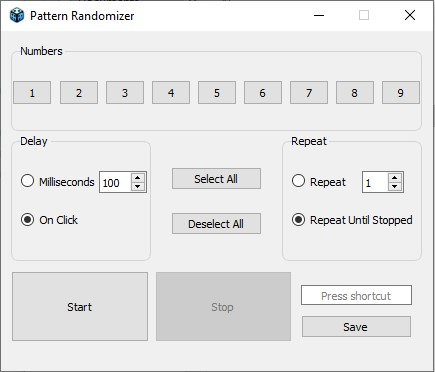

# PatternRandomizer

This program is designed to simulate Random number keyboard presses. It is primarily intended for randomizing building patterns in Minecraft and sandbox games

## Features

- Random Pattern Generation: The program provides a reliable random Pattern generation algorithm to generate random Patterns within a specified range.
- Keyboard Press Simulation: You can simulate keyboard presses in Minecraft or other sandbox games. This feature allows you to easily randomize building patterns by automatically pressing keys.
- Customizable Delay: You can set a customizable delay between each keyboard press to control the speed and timing of the building pattern randomization.
- Configurable Keybindings: You can easily configure and customize the keybindings for specific actions, giving you flexibility and control over the simulated keyboard inputs.

## Download

Download the latest version from the [releases](https://github.com/AliAlWahayb/PatternRandomizer/releases) page.

## Contributing

Contributions are welcome! If you have any suggestions, bug reports, or feature requests, please open an issue or submit a pull request.

## License

This project is licensed under the MIT License.

## Disclaimer

Please note that the use of this program in any game or application should comply with the terms and conditions of that game or application. Make sure to respect the rules and guidelines set by the respective game developers and community.
## Acknowledgements

We would like to thank the developers of the libraries and resources used in this project for their valuable contributions.
## 

If you have any questions or need further assistance, feel free to contact us at [alialwahayb@outlook.com].
